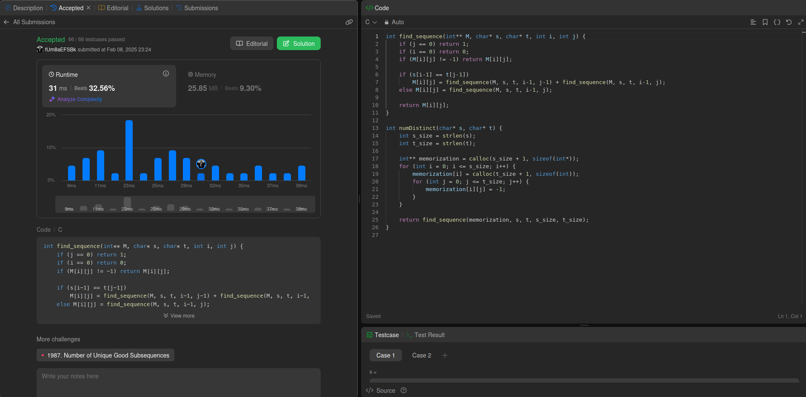

# 115. Distinct Subsequences - Difícil

<div align="center"></div>

---

## Vídeo Explicação

https://youtu.be/ZTar85coikk

---

## Link Questão

https://leetcode.com/problems/distinct-subsequences/description/

---

## *Código*

```c 
int find_sequence(int** M, char* s, char* t, int i, int j) {
    if (j == 0) return 1;  
    if (i == 0) return 0;  
    if (M[i][j] != -1) return M[i][j];  

    if (s[i-1] == t[j-1]) 
        M[i][j] = find_sequence(M, s, t, i-1, j-1) + find_sequence(M, s, t, i-1, j);
    else M[i][j] = find_sequence(M, s, t, i-1, j);
    
    return M[i][j];
}

int numDistinct(char* s, char* t) {
    int s_size = strlen(s);
    int t_size = strlen(t);

    int** memorization = calloc(s_size + 1, sizeof(int*));
    for (int i = 0; i <= s_size; i++) {
        memorization[i] = calloc(t_size + 1, sizeof(int));
        for (int j = 0; j <= t_size; j++) {
            memorization[i][j] = -1;
        }
    }

    return find_sequence(memorization, s, t, s_size, t_size);
}
```
