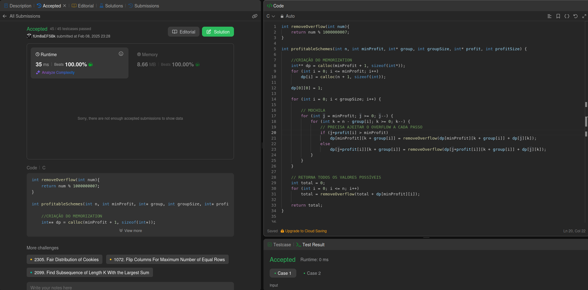

# 879. Profitable Schemes - Díficil

<div align="center"></div>

---

## Vídeo Explicação

https://youtu.be/AW7QA9KH33U

---

## Link Questão

https://leetcode.com/problems/profitable-schemes/description/

---

## *Código*

```c 
int removeOverflow(int num){
    return num % 1000000007;
}

int profitableSchemes(int n, int minProfit, int* group, int groupSize, int* profit, int profitSize) {
    
    //CRIAÇÃO DO MEMORIZATION
    int** dp = calloc(minProfit + 1, sizeof(int*));
    for (int i = 0; i <= minProfit; i++) 
        dp[i] = calloc(n + 1, sizeof(int));

    dp[0][0] = 1;

    for (int i = 0; i < groupSize; i++) {

        // MOCHILA
        for (int j = minProfit; j >= 0; j--) {
            for (int k = n - group[i]; k >= 0; k--) {
                // PRECISA AJEITAR O OVERFLOW A CADA PASSO  
                if (j+profit[i] > minProfit)
                    dp[minProfit][k + group[i]] = removeOverflow(dp[minProfit][k + group[i]] + dp[j][k]);
                else
                    dp[j+profit[i]][k + group[i]] = removeOverflow(dp[j+profit[i]][k + group[i]] + dp[j][k]);
            }
        }
    }
    
    // RETORNA TODOS OS VALORES POSSÍVEIS
    int total = 0;
    for (int i = 0; i <= n; i++) 
        total = removeOverflow(total + dp[minProfit][i]);

    return total; 
}
```
